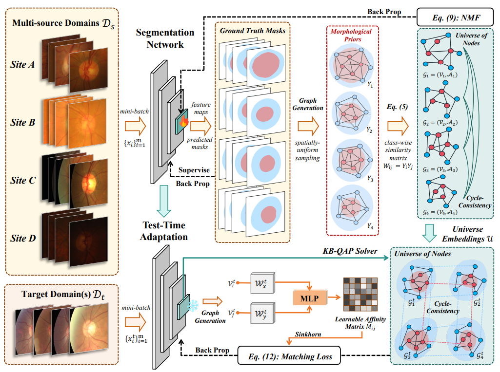

# TTDG-MGM 
[Test-Time Domain Generalization via Universe Learning: A Multi-Graph Matching Approach for Medical Image Segmentation](https://arxiv.org/abs/2503.13012)  
*Xingguo Lv, Xingbo Dong, Liwen Wang, Jiewen Yang, Lei Zhao, Bin Pu, Zhe Jin, Xuejun Li*

**Official PyTorch implementation of the CVPR 2025 paper** 

[](https://cvpr.thecvf.com/)
[](https://arxiv.org/abs/2503.13012)
[](LICENSE)


  

## Features
- 🚀 State-of-the-art performance on Retinal Fundus Segmentation and Polyp Segmentation Datasets
- ⚡ Efficient implementation with Pytorch and Mask-RCNN
- 🔧 Easy-to-use training/evaluation scripts
- 📦 Pre-trained models available

## Installation

### Prerequisites

- Python ≥ 3.6
- PyTorch ≥ 1.5 and torchvision that matches the PyTorch installation.
- Detectron2 == 0.5

### Install conda env
```bash
conda create -n ttdg python=3.7 -y
conda activate ttdg
pip install -r requirements.txt
```
 
### Build Detectron2 from Source

Follow the [INSTALL.md](https://github.com/facebookresearch/detectron2/blob/master/INSTALL.md) to install Detectron2.

## Quick Start

### Data Preparation
The preprocessed data can be downloaded from [Google Drive](https://drive.google.com/drive/folders/1axgu3-65un-wA_1OH-tQIUIEHEDrnS_-).

Organize the dataset as the COCO annotation format.
```json
{
    "images": [
        {"id": 1, "width": 640, "height": 480, "file_name": "000001.jpg"}
    ],
    "annotations": [
        {
            "id": 1,
            "image_id": 1,
            "category_id": 1,
            "segmentation": [[100, 100, 150, 100, 150, 150, 100, 150]],
            "area": 2500,
            "bbox": [100, 100, 50, 50],
            "iscrowd": 0
        }
    ],
    "categories": [
        {"id": 1, "name": "person", "supercategory": "human"}
    ]
}
```

### Test-time Adaptation with Pretrained Models
```shell
python train_net.py --eval-only --config configs/test_segment.yaml \
                MODEL.WEIGHTS <your weight>.pth
```
Download pre-trained models from [Google Drive](https://drive.google.com/drive/folders/1guHL8ykDFBWzZu6oXDmvU2hNw3UGsH7f?usp=sharing)

### Source Model Training
```shell
python train_net.py \
      --num-gpus 1 \
      --config configs/seg_res50fpn_source.yaml\
      OUTPUT_DIR output/<name>
```

## Citation

If you use this work in your research or wish to refer to the results published in the paper, please use the following BibTeX entry.
```BibTeX
@article{lv2025test,
  title={Test-Time Domain Generalization via Universe Learning: A Multi-Graph Matching Approach for Medical Image Segmentation},
  author={Lv, Xingguo and Dong, Xingbo and Wang, Liwen and Yang, Jiewen and Zhao, Lei and Pu, Bin and Jin, Zhe and Li, Xuejun},
  journal={arXiv preprint arXiv:2503.13012},
  year={2025}
}
```

## Acknowledgement
We gratefully acknowledge the following open-source projects that inspired or contributed to our implementation:
- [ThinkMatch](https://github.com/Thinklab-SJTU/ThinkMatch)
- [VPTTA](https://github.com/Chen-Ziyang/VPTTA)
- [Detectron2](https://github.com/facebookresearch/detectron2)


